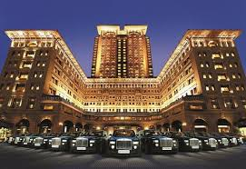
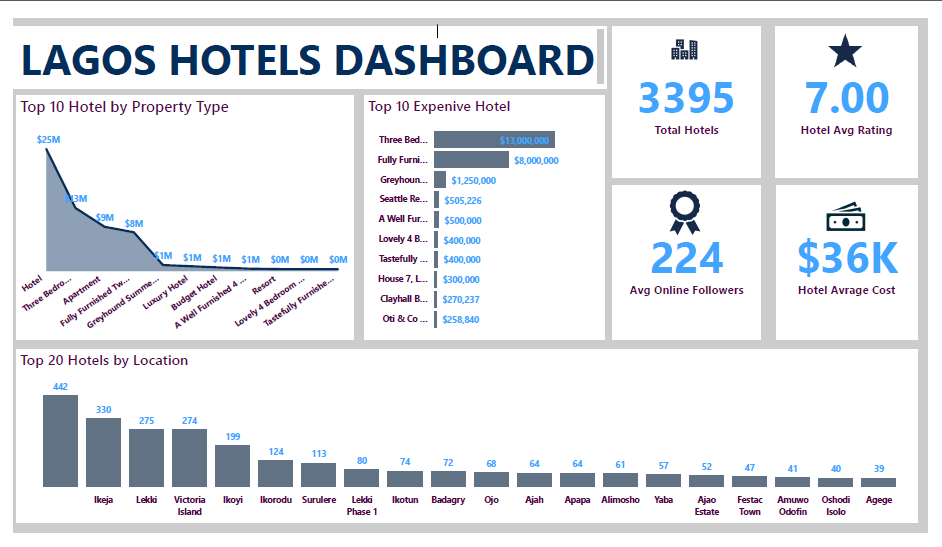

# Lagos Hotels Analysis

## Overview

Lagos is the major hub of businesses in Nigeria. The state has airports, seaports and houses several business units infact, major business headquarters sit on the heart of lagos. Being the business hubs atttracts many investors and busnessmen on daily basis from all walks of life. This huge invasion of people has leadind to the increase in demand for hotels in this metropolis as led to increase in number of hotels business to accomodate the the high turnover of investors. this subsequently  has led to increase in healthy competition among the hoteliers. The number of hotels from this part of the country as ever been increasing.

## Problem Statement

The objective of this analysis is to estimate the following:

- Locations in lagos with the highest hotel services demand.

- Most demand hotel by property type.

- Average cost of an hotel in Lagos per day.

- Average hotel rating by clients and online presence in Lagos.

 
 
 ## Skils Demonstrated
  
The following skills were demonstrated during the analysis;

  - Excel
 
  - power query
 
  - Dax formulars for measures
 
  - power Bi for the dashboard
 
  - filtering  techniques;
 

## Data Sourcing

This data is from www.kaggle.com, the booming hotel businesses inspired me to analyse this data, it is  a data file with with 7 columns and 3395 rows.

## Data Transformation

This data is an excel file. It is a single file. Power query is basically used for this data transfromation. The rating column had some mising values,  the average of the  rating was used to fill the missing values. the column addres was splitted using the delimiter "," at the left most occurrence to sepatare the area from the streets. then review columns has over 50 perent of the information missing, so i removed it so as not to have bias analysis. 

## Data Modelling

Since this is a single file, no data modelling was needed.

## Analysing and Visualization

[Clck here for the interactive dashbaord]()

- There was over 3395  hotels in lagos.

- The Lagos hotel has an average rating of 7.0 and online presence of 224 from their clients.

- The average hotel cost of hotel is 36000 naira per day.

- Ikeja, Lekki and Victoria Island has the highest number of hotels.

## Conclusions and Recommendations

 
  From the analysis, the following are recommended:

   - Hotels business is very lucrative expecially when world class facilities are available.
 
   - Ikeja, lekki and Victoria Island has a large market for hotel, so if you intend to venture into this business, these three areas are very important.
 
   - I personally recommend building shotlet appartments instead of the traditonal room ensuites, as the demand for this has been on the increase, since people come to Lagos for 
      vacation and tourist too.
 
## Disclaimer

This analysis covered only regsitered and near five star hotels and not for makeshift hotels around so the cost mght be very high compare to some localities based on the facilities available.

## Thanks
 
     

